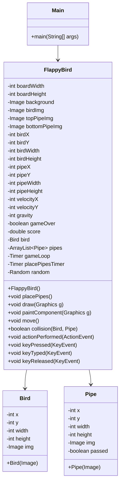

# 🐤 Flappy Bird Game (Java Swing)

This is a simple clone of the classic Flappy Bird game, built using **Java** and **Swing** for GUI rendering. The game mimics the basic mechanics of the original Flappy Bird: tap to fly, avoid obstacles, and score points.

## 🚀 Features

- Pixel-style graphics using image assets.
- Gravity-based bird movement.
- Dynamic pipe generation with random gaps.
- Score tracking system.
- Game over detection and restart on spacebar.

## 🎮 How to Play

- Press `SPACE` to make the bird fly upward.
- Avoid hitting the pipes or the ground.
- When the game ends, press `SPACE` again to restart.

## 🧱 Project Structure

```plaintext

├── Main.java           # Main entry point, sets up the JFrame window.
├── FlappyBird.java     # Core game logic, rendering, physics, and input.
├── flappybird.png      # Image asset for the bird.
├── flappybirdbg.png    # Background image.
├── toppipe.png         # Top pipe image.
├── bottompipe.png      # Bottom pipe image.
```

## 📊 Mermaid.js Class Diagram

<details>
  <summary></summary><pre><code>


</code></pre> </details>
